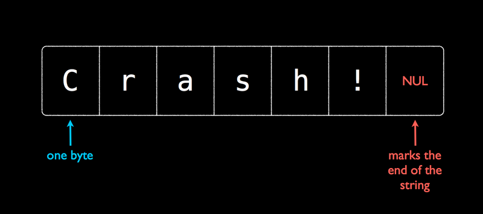
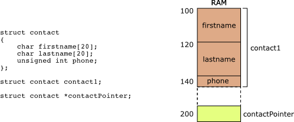

# C 编程，第 4 部分：字符串和结构

> 原文：<https://github.com/angrave/SystemProgramming/wiki/C-Programming%2C-Part-4%3A-Strings-and-Structs>

## 字符串，结构和陷阱

## 那什么是字符串？



在 C 中，由于历史原因，我们有 [Null Terminated](https://en.wikipedia.org/wiki/Null-terminated_string) 字符串而不是 [Length Prefixed](https://en.wikipedia.org/wiki/String_(computer_science)#Length-prefixed) 。对于平均日常编程而言，这意味着您需要记住空字符！ C 中的字符串被定义为一串字节，直到您达到'\ 0'或空字节。

## 两个字符串的地方

每当你定义一个常量字符串（即`char* str = "constant"`形式的那个）时，该字符串存储在数据或 _ 代码 _ 段中**只读**含义任何修改字符串的尝试都会导致段错误。

如果有一个`malloc`的空间，可以将该字符串更改为他们想要的任何内容。

## 记忆管理不善

一个常见的问题是当你写下面的内容时

```c
char* hello_string = malloc(14);
                       ___ ___ ___ ___ ___ ___ ___ ___ ___ ___ ___ ___ ___ ___
// hello_string ----> | g | a | r | b | a | g | e | g | a | r | b | a | g | e |
                       ‾‾‾ ‾‾‾ ‾‾‾ ‾‾‾ ‾‾‾ ‾‾‾ ‾‾‾ ‾‾‾ ‾‾‾ ‾‾‾ ‾‾‾ ‾‾‾ ‾‾‾ ‾‾‾
hello_string = "Hello Bhuvan!";
// (constant string in the text segment)
// hello_string ----> [ "H" , "e" , "l" , "l" , "o" , " " , "B" , "h" , "u" , "v" , "a" , "n" , "!" , "\0" ]
                       ___ ___ ___ ___ ___ ___ ___ ___ ___ ___ ___ ___ ___ ___
// memory_leak -----> | g | a | r | b | a | g | e | g | a | r | b | a | g | e |
                       ‾‾‾ ‾‾‾ ‾‾‾ ‾‾‾ ‾‾‾ ‾‾‾ ‾‾‾ ‾‾‾ ‾‾‾ ‾‾‾ ‾‾‾ ‾‾‾ ‾‾‾ ‾‾‾
hello_string[9] = 't'; //segfault!!
```

我们做了什么？我们为 14 个字节分配了空间，重新分配指针并成功进行了 segfaulted！记得要记录你的指针在做什么。您可能想要做的是使用`string.h`功能`strcpy`。

```c
strcpy(hello_string, "Hello Bhuvan!");
```

## 记住 NULL 字节！

忘记 NULL 终止字符串对字符串有很大的影响！界限检查很重要。之前在 wikibook 中提到的心脏病是部分原因。

## 我在哪里可以找到所有这些功能的深入和分配 - 综合解释？

[就在这里！](https://linux.die.net/man/3/string)

## 字符串信息/比较：`strlen` `strcmp`

`int strlen(const char *s)`返回不包括空字节的字符串的长度

`int strcmp(const char *s1, const char *s2)`返回一个确定字符串的字典顺序的整数。如果 s1 在字典中的 s2 之前到达，则返回-1。如果两个字符串相等，则为 0.否则为 1。

对于大多数这些函数，他们希望字符串是可读的而不是 NULL，但是当你将它们传递给 NULL 时会有未定义的行为。

## 字符串更改：`strcpy` `strcat` `strdup`

`char *strcpy(char *dest, const char *src)`将`src`处的字符串复制到`dest`。 **假设 dest 有足够的空间用于 src**

`char *strcat(char *dest, const char *src)`将`src`的字符串连接到目的地的末尾。 **此函数假定目的地末尾有足够的`src`空间，包括 NULL 字节**

`char *strdup(const char *dest)`返回字符串的`malloc`编辑副本。

## 字符串搜索：`strchr` `strstr`

`char *strchr(const char *haystack, int needle)`返回指向`haystack`中第一次出现`needle`的指针。如果没有找到，则返回`NULL`。

`char *strstr(const char *haystack, const char *needle)`与上面相同，但这次是一个字符串！

## 字符串标记：`strtok`

一个危险但有用的函数 strtok 需要一个字符串并将其标记化。这意味着它会将字符串转换为单独的字符串。这个函数有很多规格，所以请阅读手册，下面是一个人为的例子。

```c
#include <stdio.h>
#include <string.h>

int main(){
    char* upped = strdup("strtok,is,tricky,!!");
    char* start = strtok(upped, ",");
    do{
        printf("%s\n", start);
    }while((start = strtok(NULL, ",")));
    return 0;
}
```

**输出**

```c
strtok
is
tricky
!!
```

当我像这样更改`upped`时会发生什么？

```c
char* upped = strdup("strtok,is,tricky,,,!!");
```

## 记忆运动：`memcpy`和`memmove`

为什么`&lt;string.h&gt;`和`memmove`都在`&lt;string.h&gt;`中？因为字符串本质上是原始内存，在它们的末尾有一个空字节！

`void *memcpy(void *dest, const void *src, size_t n)`将从`str`开始的`n`字节移动到`dest`。 **注意**当内存区域重叠时，存在未定义的行为。这是我的机器示例中的经典作品之一，因为很多时候 valgrind 将无法拾取它，因为它看起来像是在你的机器上运行。当自动编程器命中时，失败。考虑更安全的版本。

`void *memmove(void *dest, const void *src, size_t n)`执行与上面相同的操作，但如果内存区域重叠，则可以保证所有字节都将被正确复制。

## 那么什么是`struct`？



在低层次上，结构只是一块连续的内存，仅此而已。就像数组一样，struct 有足够的空间来保留其所有成员。但与数组不同，它可以存储不同的类型。考虑上面声明的 contact 结构

```c
struct contact {
    char firstname[20];
    char lastname[20];
    unsigned int phone;
};

struct contact bhuvan;
```

**暂且不谈**

```c
/* a lot of times we will do the following typdef
 so we can just write contact contact1 */

typedef struct contact contact;
contact bhuvan;

/* You can also declare the struct like this to get
 it done in one statement */
typedef struct optional_name {
    ...
} contact;
```

如果在没有任何优化和重新排序的情况下编译代码，您可以期望每个变量的地址看起来像这样。

```c
&bhuvan           // 0x100
&bhuvan.firstname // 0x100 = 0x100+0x00
&bhuvan.lastname  // 0x114 = 0x100+0x14
&bhuvan.phone     // 0x128 = 0x100+0x28
```

因为你所有的编译器都说'嘿保留这么多空间，我将去计算你想写的任何变量的偏移'。

## 这些补偿是什么意思？

偏移量是变量开始的位置。电话变量从`0x128`个字节开始，并继续为 sizeof（int）字节，但并非总是如此。 **偏移不会确定**变量的结束位置。考虑一下你在很多内核代码中看到的以下 hack。

```c
typedef struct {
    int length;
    char c_str[0];
} string;

const char* to_convert = "bhuvan";
int length = strlen(to_convert);

// Let's convert to a c string
string* bhuvan_name;
bhuvan_name = malloc(sizeof(string) + length+1);
/*
Currently, our memory looks like this with junk in those black spaces
 ___ ___ ___ ___ ___ ___ ___ ___ ___ ___ ___
 bhuvan_name = |   |   |   |   |   |   |   |   |   |   |   |
 ‾‾‾ ‾‾‾ ‾‾‾ ‾‾‾ ‾‾‾ ‾‾‾ ‾‾‾ ‾‾‾ ‾‾‾ ‾‾‾ ‾‾‾
*/

bhuvan_name->length = length;
/*
This writes the following values to the first four bytes
The rest is still garbage
 ___ ___ ___ ___ ___ ___ ___ ___ ___ ___ ___
 bhuvan_name = | 0 | 0 | 0 | 6 |   |   |   |   |   |   |   |
 ‾‾‾ ‾‾‾ ‾‾‾ ‾‾‾ ‾‾‾ ‾‾‾ ‾‾‾ ‾‾‾ ‾‾‾ ‾‾‾ ‾‾‾
*/

strcpy(bhuvan_name->c_str, to_convert);
/*
Now our string is filled in correctly at the end of the struct

 ___ ___ ___ ___ ___ ___ ___ ___ ___ ___ ____
 bhuvan_name = | 0 | 0 | 0 | 6 | b | h | u | v | a | n | \0 |
 ‾‾‾ ‾‾‾ ‾‾‾ ‾‾‾ ‾‾‾ ‾‾‾ ‾‾‾ ‾‾‾ ‾‾‾ ‾‾‾ ‾‾‾‾
*/

strcmp(bhuvan_name->c_str, "bhuvan") == 0 //The strings are equal!
```

## 但并非所有结构都是完美的

结构可能需要一些称为[填充](http://www.catb.org/esr/structure-packing/)（教程）的东西。 **我们不希望你在这个课程中打包结构，只知道它在那里这是因为在早期（甚至现在）当你需要从内存中的地址时你必须在 32 位或 64 位块中进行。这也意味着您只能请求多个地址的地址。意思是

```c
struct picture{
    int height;
    pixel** data;
    int width;
    char* enconding;
}
// You think picture looks like this
           height      data         width     encoding
           ___ ___ ___ ___ ___ ___ ___ ___ ___ ___ ___ ___
picture = |       |               |       |               |
           ‾‾‾ ‾‾‾ ‾‾‾ ‾‾‾ ‾‾‾ ‾‾‾ ‾‾‾ ‾‾‾ ‾‾‾ ‾‾‾ ‾‾‾ ‾‾‾
```

在概念上可能看起来像这样

```c
struct picture{
    int height;
    char slop1[4];
    pixel** data;
    int width;
    char slop2[4];
    char* enconding;
}
           height   slop1       data        width   slop2  encoding
           ___ ___ ___ ___ ___ ___ ___ ___ ___ ___ ___ ___ ___ ___ ___ ___
picture = |       |       |               |       |       |               |
           ‾‾‾ ‾‾‾ ‾‾‾ ‾‾‾ ‾‾‾ ‾‾‾ ‾‾‾ ‾‾‾ ‾‾‾ ‾‾‾ ‾‾‾ ‾‾‾ ‾‾‾ ‾‾‾ ‾‾‾ ‾‾‾
```

（这是在 64 位系统上）并非总是如此，因为有时您的处理器支持未对齐的访问。这是什么意思？那么您可以设置两个属性选项

```c
struct __attribute__((packed, aligned(4))) picture{
    int height;
    pixel** data;
    int width;
    char* enconding;
}
// Will look like this
           height       data        width     encoding
           ___ ___ ___ ___ ___ ___ ___ ___ ___ ___ ___ ___
picture = |       |               |       |               |
           ‾‾‾ ‾‾‾ ‾‾‾ ‾‾‾ ‾‾‾ ‾‾‾ ‾‾‾ ‾‾‾ ‾‾‾ ‾‾‾ ‾‾‾ ‾‾‾
```

但现在每次我想访问`data`或`encoding`时，我都要进行两次内存访问。您可以做的另一件事是重新排序结构，尽管这并不总是可行的

```c
struct picture{
    int height;
    int width;
    pixel** data;
    char* enconding;
}
// You think picture looks like this
           height   width        data         encoding
           ___ ___ ___ ___ ___ ___ ___ ___ ___ ___ ___ ___
picture = |       |       |               |               |
           ‾‾‾ ‾‾‾ ‾‾‾ ‾‾‾ ‾‾‾ ‾‾‾ ‾‾‾ ‾‾‾ ‾‾‾ ‾‾‾ ‾‾‾ ‾‾‾
```