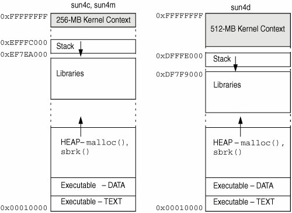

# 进程，第 1 部分：简介

> 原文：[Processes, Part 1: Introduction](https://github.com/angrave/SystemProgramming/wiki/Processes%2C-Part-1%3A-Introduction)

> 校验：[飞龙](https://github.com/wizardforcel)

> 自豪地采用[谷歌翻译](https://translate.google.cn/)

## 概览

进程是运行中的程序（大致）。进程也只是这个运行中的计算机程序的一个实例。进程有很多东西可供使用。在每个程序启动时，您将获得一个进程，但每个程序可以创建更多进程。实际上，您的操作系统只启动了一个进程，所有其他进程都是由它分叉的 - 所有这些都是在启动时在背后完成的。

## 好吧，但是什么是程序？

程序通常包含以下内容

+   二进制格式：告诉操作系统二进制中的哪些位集是什么 -- 哪个部分是可执行的，哪些部分是常量，要包括哪些库等。
+   一套机器指令
+   表示从哪条指令开始的数字
+   常量
+   要链接的库以及在何处填写这些库的地址

## 最开始

当您的操作系统在 Linux 机器上启动时，会创建一个名为`init.d`的进程。该进程是个处理信号和中断的特殊进程，和某些内核元素的持久性模块。无论何时想要创建一个新进程，都可以调用`fork`（将在后面的部分中讨论）并使用另一个函数来加载另一个程序。

## 进程隔离

进程非常强大，但它们是隔离的！这意味着默认情况下，任何进程都无法与另一个进程通信。这非常重要，因为如果你有一个大型系统（比方说 EWS），那么你希望某些进程拥有比普通用户更高的权限（监控，管理员），并且当然不希望普通用户通过有意或无意修改进程，能够搞崩整个系统。

如果我在两个不同的终端上运行以下代码，

```
int secrets; //maybe defined in the kernel or else where
secrets++;
printf("%d\n", secrets); 
```

正如你猜测的那样，它们都打印出 1 而不是 2。即使我们改变了代码来做一些真正的黑魔法（除了直接读取内存），也没有办法改变另一个进程的状态（好吧，也许 [DirtyCow](https://en.wikipedia.org/wiki/Dirty_COW) 可以，但这有点太深入了）。

## 进程内容

## 内存布局



当进程启动时，它会获得自己的地址空间。意味着每个进程得到：

*   **一个栈**。栈是存储自动变量和函数调用返回地址的位置。每次声明一个新变量时，程序都会向下移动栈指针来保留变量的空间。栈的这一部分是可写的但不可执行。如果栈增长得太远（意味着它增长超出预设边界或与堆相交），您将获得栈溢出，最有可能导致 SEGFAULT 或类似的东西。**栈默认静态分配，意味着只有一定数量的可写空间**。
*   **堆**。堆是一个扩展的内存区域。如果你想分配一个大对象，它就在这里。堆从文本段的顶部开始向上增长（有时当你调用`malloc`它要求操作系统向上推动堆边界）。此区域也是可写但不可执行。如果系统受限制或者地址耗尽（在 32 位系统上更常见），则可能会耗尽堆内存。
*   **数据段**包含所有全局变量。此部分从 Text 段的末尾开始，并且大小是静态的，因为在编译时已知全局变量。这部分是可写的但不是可执行的，这里没有太过花哨的其他任何东西。
*   **文本段**。可以说，这是地址中最重要的部分。这是存储所有代码的地方。由于汇编代码编译为 1 和 0，因此这是存储 1 和 0 的地方。程序计数器在该段中移动来执行指令，并向下一条指令移动。请务必注意，这是代码中唯一的可执行部分。如果您尝试在运行时更改代码，很可能会出现段错误（有很多方法可以解决它，但只是假设它是段错误）。
*   为什么不从零开始？它在这个课程的[范围](https://en.wikipedia.org/wiki/Address_space_layout_randomization)之外，但它是为了安全。

## 进程 ID（PID）

为了跟踪所有这些进程，您的操作系统为每个进程提供一个编号，该进程称为 PID，即进程 ID。 进程也有一个 ppid，它是父进程 ID 的缩写。 每个进程都有一个父进程，该父进程可以是`init.d`。

进程也可以包含：

+   运行状态 -- 进程是否正在准备，运行，停止，终止等。
+   文件描述符 -- 整数到实际设备（文件，USB 记忆棒，套接字）的映射列表
+   权限 -- 正在运行文件的用户以及进程所属的组。 然后，该进程只对这个用户或组是可接受的，就像打开用户已经设为排他的文件一样。 有一些技巧可以使程序不成为启动该程序的用户，即`sudo`接受一个由用户启动的程序并以`root`身份执行该程序。
+   参数 -- 字符串列表，告诉您的程序要在哪些参数下运行。
+   环境列表 -- 可以修改的格式为`NAME=VALUE`的字符串列表。
