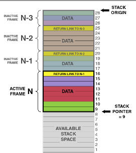
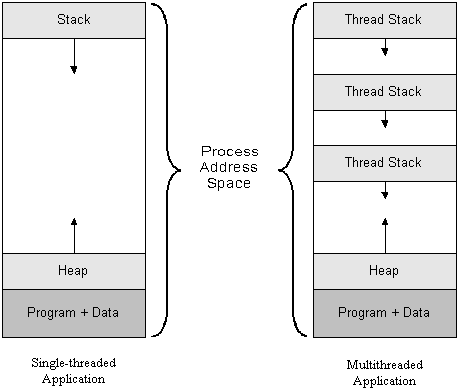

# Pthreads，第1部分：简介

> 原文：<https://github.com/angrave/SystemProgramming/wiki/Pthreads%2C-Part-1%3A-Introduction>

## 线程简介

## 什么是线程？

线程是“执行线程”的缩写。它表示CPU具有（并将执行）的指令序列。要记住如何从函数调用返回，并存储自动变量和参数的值，线程使用堆栈。

## 什么是轻量级过程（LWP）？它与线程有什么关系？

好吧，对于所有意图和目的，线程是一个过程（意味着创建一个线程类似于`fork`），除了**没有复制**意味着没有写入副本。这允许进程共享相同的地址空间，变量，堆，文件描述符等。

创建线程的实际系统调用类似于`fork`;这是`clone`。我们不会详细说明，但您可以阅读[手册页](http://man7.org/linux/man-pages/man2/clone.2.html)，请记住它不在本课程的直接范围内。

LWP或线程更倾向于分配许多场景，因为创建它们的开销要少得多。但在某些情况下（特别是python使用它）多处理是使代码更快的方法。

## 线程的堆栈如何工作？

您的主要功能（以及您可能调用的其他功能）具有自动变量。我们将使用堆栈将它们存储在内存中，并使用简单的指针（“堆栈指针”）跟踪堆栈的大小。如果线程调用另一个函数，我们将堆栈指针向下移动，这样我们就有更多的空间用于参数和自动变量。一旦从函数返回，我们就可以将堆栈指针移回其先前的值。我们保留旧堆栈指针值的副本 - 在堆栈上！这就是为什么从函数返回非常快 - 很容易“释放”自动变量使用的内存 - 我们只需要更改堆栈指针。



在多线程程序中，有多个堆栈但只有一个地址空间。 pthread库分配一些堆栈空间（在堆中或使用主程序堆栈的一部分）并使用`clone`函数调用在该堆栈地址处启动线程。总地址空间可能看起来像这样。



## 我的流程可以有多少个线程？

您可以在进程内运行多个线程。你免费得到第一个帖子！它运行你在'main'中编写的代码。如果需要更多线程，可以使用pthread库调用`pthread_create`创建新线程。您需要将指针传递给函数，以便线程知道从哪里开始。

您创建的线程都存在于同一个虚拟内存中，因为它们是同一进程的一部分。因此，他们都可以看到堆，全局变量和程序代码等。因此，您可以在同一个进程内同时处理两个（或多个）CPU。由操作系统决定将线程分配给CPU。如果你有比CPU更多的活动线程，那么内核会将线程分配给CPU很短的时间（或直到它用完了要做的事情），然后自动切换CPU在另一个线程上工作。例如，一个CPU可能正在处理游戏AI而另一个线程正在计算图形输出。

## 简单用法

## 你好世界pthread的例子

要使用pthread，您需要包含`pthread.h`并且需要使用`-pthread`（或`-lpthread`）编译器选项进行编译。此选项告诉编译器您的程序需要线程支持

要创建线程，请使用函数`pthread_create`。这个函数有四个参数：

```c
int pthread_create(pthread_t *thread, const pthread_attr_t *attr,
                   void *(*start_routine) (void *), void *arg);
```

*   第一个是指向一个变量的指针，该变量将保存新创建的线程的id。
*   第二个是指向属性的指针，我们可以使用它来调整和调整pthreads的一些高级功能。
*   第三个是指向我们想要运行的函数的指针
*   第四个是指向我们的函数的指针

论点`void *(*start_routine) (void *)`很难读懂！它表示一个指针，它接受一个`void *`指针并返回一个`void *`指针。它看起来像一个函数声明，除了函数的名称用`(* .... )`包装

这是最简单的例子：

```c
#include <stdio.h>
#include <pthread.h>
// remember to set compilation option -pthread

void *busy(void *ptr) {
// ptr will point to "Hi"
    puts("Hello World");
    return NULL;
}
int main() {
    pthread_t id;
    pthread_create(&id, NULL, busy, "Hi");
    while (1) {} // Loop forever
}
```

如果我们想等待我们的线程完成使用`pthread_join`

```c
void *result;
pthread_join(id, &result);
```

在上面的例子中，`result`将是`null`，因为busy函数返回`null`。我们需要传递结果地址，因为`pthread_join`将写入指针的内容。

见 [Pthreads第2部分](https://github.com/angrave/SystemProgramming/wiki/Pthreads%2C-Part-2%3A-Usage-in-Practice)