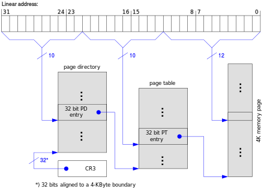

# 虚拟内存，第 1 部分：虚拟内存简介

> 原文：<https://github.com/angrave/SystemProgramming/wiki/Virtual-Memory%2C-Part-1%3A-Introduction-to-Virtual-Memory>

## 什么是虚拟内存？

在非常简单的嵌入式系统和早期计算机中，进程直接访问存储器，即“地址 1234”对应于存储在物理存储器的特定部分中的特定字节。在现代系统中，情况已不再如此。而是每个过程都是孤立的;并且在特定 CPU 指令的地址或进程的数据与物理存储器的实际字节（“RAM”）之间存在转换过程。内存地址不再是“真实的”;该进程在虚拟内存中运行。虚拟内存不仅可以保证进程的安全（因为一个进程无法直接读取或修改另一个进程的内存），它还允许系统有效地为不同的进程分配和重新分配内存部分。

## 什么是 MMU？

内存管理单元是 CPU 的一部分。它将虚拟内存地址转换为物理地址。如果当前没有从特定虚拟地址到物理地址的映射，或者当前 CPU 指令尝试写入该进程仅具有读访问权的位置，则 MMU 也可以中断 CPU。

## 那么我们如何将虚拟地址转换为物理地址呢？

想象一下，你有一台 32 位机器。指针可以保持 32 位，即它们可以寻址 2 ^ 32 个不同的位置，即 4GB 的存储器（我们将遵循一个地址的标准约定可以保持一个字节）。

想象一下，我们有一个大表 - 这里是聪明的部分 - 存储在内存中！对于每个可能的地址（全部 40 亿个），我们将存储“真实”即物理地址。每个物理地址需要 4 个字节（保存 32 位）。该方案需要 160 亿个字节来存储所有条目。哎呀 - 我们的查找方案会占用我们可能为 4GB 机器购买的所有内存。我们需要做得比这更好。我们的查找表最好小于我们的内存，否则我们的实际程序和操作系统数据将没有空间。解决方案是将内存分块为称为“页面”和“帧”的小区域，并为每个页面使用查找表。

## 什么是页面？他们中有多少人？

页面是一块虚拟内存。 Linux 操作系统上的典型块大小为 4KB（即 2 ^ 12 个地址），但您可以找到更大块的示例。

因此，我们不是谈论单个字节，而是讨论 4KB 的块，而每个块都称为页面。我们也可以为我们的页面编号（“第 0 页”“第 1 页”等）

## EX：32 位机器中有多少页（假设页面大小为 4KB）？

答案：2 ^ 32 地址/ 2 ^ 12 = 2 ^ 20 页。

请记住，2 ^ 10 是 1024，所以 2 ^ 20 有点超过一百万。

对于 64 位机器，2 ^ 64/2 ^ 12 = 2 ^ 52，大约 10 ^ 15 页。

## 什么是框架？

帧（或有时称为“页面帧”）是 _ 物理存储器 _ 或 RAM（=随机存取存储器）的块。这种内存有时被称为“主存储”（与较慢的二级存储形成对比，例如具有较低访问时间的旋转磁盘）

帧与虚拟页面的字节数相同。如果 32 位机器具有 2 ^ 32（4GB）的 RAM，那么在机器的可寻址空间中将有相同数量的 RAM。 64 位机器不太可能拥有 2 ^ 64 字节的 RAM - 你能明白为什么吗？

## 什么是页面表，它有多大？

页表是页面与帧之间的映射。例如，第 1 页可能映射到第 45 帧，第 2 页映射到第 30 帧。其他帧当前可能未使用或分配给其他正在运行的进程，或者由操作系统在内部使用。

一个简单的页表只是一个数组，`int frame = table[ page_num ];`

对于具有 4KB 页面的 32 位机器，每个条目需要保持帧号 - 即 20 位，因为我们计算出有 2 ^ 20 帧。这是每个条目 2.5 个字节！实际上，我们将每个条目最多四个字节舍入，并找到这些备用位的用途。每个条目 4 个字节 x 2 ^ 20 个条目= 4 MB 的物理内存需要保存页表。

对于具有 4KB 页面的 64 位机器，每个条目需要 52 位。让每个条目向上舍入到 64 位（8 字节）。有 2 ^ 52 个条目，即 2 ^ 55 个字节（大约 40 peta 字节...）哎呀我们的页面表太大了。

在 64 位体系结构中，内存地址是稀疏的，因此我们需要一种机制来减少页表大小，因为大多数条目永远不会被使用。


页面表的可视示例在这里。想象一下，访问一个数组并抓住数组元素。

## 什么是偏移量以及它是如何使用的？

请记住，我们的页面表将页面映射到帧，但每个页面都是一个连续的地址块。我们如何计算在特定帧内使用哪个特定字节？解决方案是直接重用虚拟内存地址的最低位。例如，假设我们的进程正在读取以下地址 - `VirtualAddress = 11110000111100001111000010101010 (binary)`

在页面大小为 256 字节的计算机上，最低的 8 位（10101010）将用作偏移量。剩余的高位将是页码（111100001111000011110000）。

## 多级页表

多级页面是 64 位体系结构的页表大小问题的一种解决方案。我们将看一下最简单的实现 - 一个两级页表。每个表都是指向下一级表的指针列表，并非所有子表都需要存在。一个示例，32 位架构的两级页表如下所示 -

```
VirtualAddress = 11110000111111110000000010101010 (binary)
                 |_Index1_||        ||          | 10 bit Directory index
                           |_Index2_||          | 10 bit Sub-table index
                                     |__________| 12 bit offset (passed directly to RAM) 
```

在上述方案中，确定帧号需要两次存储器读取：最顶层的 10 位用于页表的目录中。如果每个条目使用 2 个字节，我们只需要 2KB 来存储整个目录。每个子表将指向物理帧（即，需要 4 个字节来存储 20 位）。但是，对于只有微小内存需求的进程，我们只需要为低内存地址（用于堆和程序代码）和高内存地址（用于栈）指定条目。每个子表是 1024 个条目×4 个字节，即每个子表 4KB。因此，我们的多级页表的总内存开销从 4MB（单级）缩减到 3 帧内存（12KB）！

页表会使内存访问速度变慢吗？ （什么是 TLB）

是的 - 很重要！ （但是由于聪明的硬件，通常没有...）与直接读取或写入内存相比。对于单页表，我们的机器现在慢两倍！ （需要两次内存访问）对于两级页表，内存访问速度现在是后者的三倍。 （需要三次内存访问）

为了克服这种开销，MMU 包括最近使用的虚拟页面到帧查找的关联缓存。此缓存称为 TLB（“转换后备缓冲区”）。每次需要将虚拟地址转换为物理内存位置时，都会与页表并行查询 TLB。对于大多数程序的大多数内存访问，TLB 很可能缓存了结果。但是，如果程序没有良好的高速缓存一致性（例如从许多不同页面的随机存储器位置读取），则 TLB 将不具有结果高速缓存，并且现在 MMU 必须使用更慢的页表来确定物理帧。



这可能是分割多级页表的方式。

## 高级框架和页面保护

## 框架可以在进程之间共享吗？他们可以专业吗？

是!除了存储帧号之外，页表还可用于存储进程是写入还是仅读取特定帧。然后可以在多个进程之间安全地共享只读帧。例如，可以在将代码动态加载到进程内存中的所有进程之间共享 C 库指令代码。每个进程只能读取该内存。这意味着如果您尝试写入内存中的只读页面，您将获得`SEGFAULT`。这就是为什么有时内存访问段错误，有时它们没有，这一切都取决于你的硬件是否说你可以访问。

此外，进程可以使用`mmap`系统调用与子进程共享页面。 `mmap`是一个有趣的调用，因为它不是将每个虚拟地址绑定到物理帧，而是将其与其他东西联系起来。其他东西可以是文件，GPU 单元或您可以想到的任何其他内存映射操作！写入内存地址可能会写入设备，或者写入可能会被操作系统暂停，但这是一个非常强大的抽象，因为操作系统通常能够执行优化（多个进程内存映射同一个文件可以有内核）创建一个映射）。

## 页面表中还存储了什么？为什么？

除了上面讨论的只读位和使用统计信息之外，通常至少存储只读，修改和执行信息。

## 什么是页面错误？

页面错误是指正在运行的程序试图访问未映射到物理内存的地址空间中的某个虚拟内存。页面错误也会在其他情况下发生。

页面错误有三种类型

**次要**如果页面尚未映射，但它是有效地址。这可能是`sbrk(2)`要求的内存，但尚未写入，这意味着操作系统可以在分配空间之前等待第一次写入。操作系统只需创建页面，将其加载到内存中，然后继续操作。

**Major** 如果映射到页面不在内存中但在磁盘上。这样做是将页面交换到内存并交换另一页。如果这种情况经常发生，你的程序就会被称为 _thrash_ MMU。

**无效**当您尝试写入不可写存储器地址或读取不可读存储器地址时。 MMU 生成无效错误，操作系统通常会生成`SIGSEGV`意味着分段违规，这意味着您在可以写入的段外编写。

### 只读位

只读位将页面标记为只读。尝试写入页面将导致页面错误。然后页面错误将由内核处理。只读页面的两个示例包括在多个进程之间共享 c 运行时库（为了安全起见，您不希望允许一个进程修改该库）;和 Copy-On-Write，其中复制页面的成本可以延迟到第一次写入发生。

### 肮脏的一点

[http://en.wikipedia.org/wiki/Page_table#Page_table_data](http://en.wikipedia.org/wiki/Page_table#Page_table_data)

> 脏位允许性能优化。磁盘上的页面被分页到物理内存，然后从中读取，然后再次被分页，不需要写回磁盘，因为页面没有更改。但是，如果页面在页面被写入之后被写入，则将设置其脏位，指示必须将页面写回到后备存储。此策略要求后备存储在将页面分页到内存后保留页面的副本。当不使用脏位时，后备存储只需要与任何时刻所有页面调出页面的瞬时总大小一样大。使用脏位时，物理内存和后备存储中都会存在一些页面。

### 执行位

执行位定义页面中的字节是否可以作为 CPU 指令执行。通过禁用页面，它可以防止恶意存储在进程存储器中的代码（例如，通过栈溢出）被轻易执行。 （进一步阅读： [http://en.wikipedia.org/wiki/NX_bit#Hardware_background](http://en.wikipedia.org/wiki/NX_bit#Hardware_background) ）

### 了解更多

在[ [http://wiki.osdev.org/Paging](http://wiki.osdev.org/Paging) ]中讨论了对 x86 平台上的分页和页面位的越来越多的技术讨论。