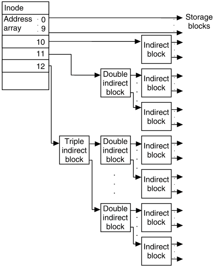

# 文件系统，第 9 部分：磁盘块示例

> 原文：<https://github.com/angrave/SystemProgramming/wiki/File-System%2C-Part-9%3A-Disk-blocks-example>

## 正在施工🚧

## 请问您能解释一下文件内容如何存储在简单的基于 i 节点的文件系统中的简单模型吗？

当然！要回答这个问题，我们将构建一个虚拟磁盘，然后编写一些 C 代码来访问其内容。我们的文件系统将可用字节划分为 inode 的空间和磁盘块的更大空间。每个磁盘块将为 4096 字节 -

```c
// Disk size:
#define MAX_INODE (1024)
#define MAX_BLOCK (1024*1024)

// Each block is 4096 bytes:
typedef char[4096] block_t;

// A disk is an array of inodes and an array of disk blocks:
struct inode[MAX_INODE] inodes;
block[MAX_BLOCK] blocks;
```

请注意，为了清楚起见，我们不会在此代码示例中使用“unsigned”。我们的固定大小的 inode 将包含文件的大小（以字节为单位），权限，用户，组信息，时间元数据。与问题最相关的是它还包括十个指向磁盘块的指针，我们将使用这些指针来引用实际文件的内容！

```c
struct inode {
 int[10] directblocks; // indices for the block array i.e. where to the find the file's content
 long size;
 // ... standard inode meta-data e.g.
 int mode, userid,groupid;
 time_t ctime,atime,mtime;
}
```

现在我们可以弄清楚如何读取文件偏移量`position`的字节：

```c
char readbyte(inode*inode,long position) {
  if(position <0 || position >= inode->size) return -1; // invalid offset

  int  block_count = position / 4096,offset = position % 4096;

  // block count better be 0..9 !
  int physical_idx = lookup_physical_block_index(inode, block_count );

  // sanity check that the disk block index is reasonable...
  assert(physical_idx >=0 && physical_idx < MAX_BLOCK);

  // read the disk block from our virtual disk 'blocks' and return the specific byte
  return blocks[physical_idx][offset];
}
```

我们的 lookup_physical_block 的初始版本很简单 - 我们可以使用 10 个直接块的表格！

```c
int lookup_physical_block_index(inode*inode, int block_count) {
  assert(block_count>=0 && block_count < 10);

  return inode->directblocks[ block_count ]; // returns an index value between [0,MAX_BLOCK)
}
```

这种简单的表示是合理的，只要我们可以用十个块表示所有可能的文件，即最多 40KB。大文件怎么样？我们需要 inode 结构始终具有相同的大小，因此将现有的直接块数组增加到 20 将大约是我们的 inode 大小的两倍。如果我们的大多数文件需要少于 10 个块，那么我们的 inode 存储现在是浪费的。为了解决这个问题，我们将使用一个名为 _ 间接块 _ 的磁盘块来扩展指针数组。我们只需要这个文件＆gt; 40KB

```c
struct inode {
 int[10] directblocks; // if size<4KB then only the first one is valid
 int indirectblock; // valid value when size >= 40KB
 int size;
 ...
}
```

间接块只是一个 4096 字节的常规磁盘块，但我们将使用它来保存指向磁盘块的指针。在这种情况下我们的指针只是整数，所以我们需要将指针强制转换为整数指针：

```c
int lookup_physical_block_index(inode*inode, int block_count) {
  assert(sizeof(int)==4); // Warning this code assumes an index is 4 bytes!
  assert(block_count>=0 && block_count < 1024 + 10); // 0 <= block_count< 1034

  if( block_count < 10)
     return inode->directblocks[ block_count ];

  // read the indirect block from disk:
  block_t* oneblock = & blocks[ inode->indirectblock ];

  // Treat the 4KB as an array of 1024 pointers to other disk blocks
  int* table = (int*) oneblock;

 // Look up the correct entry in the table
 // Offset by 10 because the first 10 blocks of data are already 
 // accounted for
  return table[ block_count - 10 ];
}
```

对于典型的文件系统，我们的索引值是 32 位，即 4 字节。因此，在 4096 字节中，我们可以存储 4096/4 = 1024 个条目。这意味着我们的间接块可以引用 1024 * 4KB = 4MB 的数据。通过前十个直接块，我们可以容纳最大 40KB + 1024 * 4KB = 4136KB 的文件。对于小于此值的文件，某些后续表条目可能无效。

对于更大的文件，我们可以使用两个间接块。然而，有一个更好的选择，这将允许我们有效地扩展到大型文件。我们将包含一个双间接指针，如果这还不够三重间接指针。双重间接指针意味着我们有一个 1024 个条目表到磁盘块，用作 1024 个条目。这意味着我们可以参考 1024 * 1024 个磁盘数据块。



（来源： [http://uw714doc.sco.com/en/FS_admin/graphics/s5chain.gif](http://uw714doc.sco.com/en/FS_admin/graphics/s5chain.gif) ）

```c
int lookup_physical_block_index(inode*inode, int block_count) {
  if( block_count < 10)
     return inode->directblocks[ block_count ];

  // Use indirect block for the next 1024 blocks:
  // Assumes 1024 ints can fit inside each block!
  if( block_count < 1024 + 10) {   
      int* table = (int*) & blocks[ inode->indirectblock ];
      return table[ block_count - 10 ];
  }
  // For huge files we will use a table of tables
  int i = (block_count - 1034) / 1024 , j = (block_count - 1034) % 1024;
  assert(i<1024); // triple-indirect is not implemented here!

  int* table1 = (int*) & blocks[ inode->doubleindirectblock ];
   // The first table tells us where to read the second table ...
  int* table2 = (int*) & blocks[   table1[i]   ];
  return table2[j];

   // For gigantic files we will need to implement triple-indirect (table of tables of tables)
}
```

请注意，使用 double indirect 读取字节需要 3 个磁盘块读取（两个表和实际数据块）。